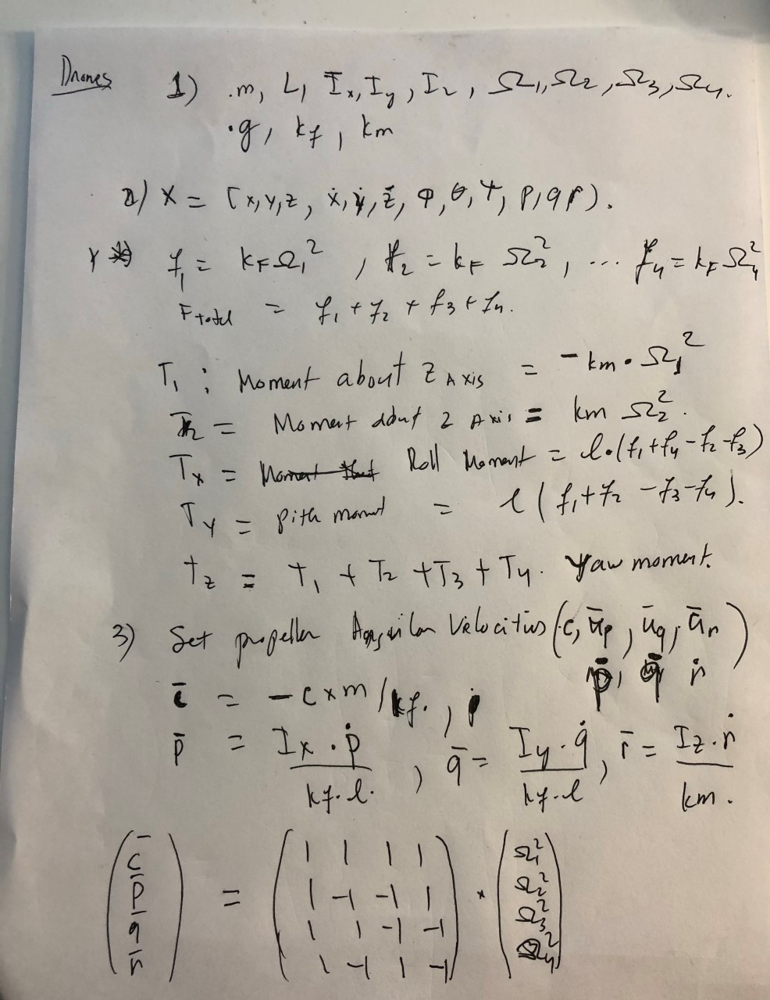
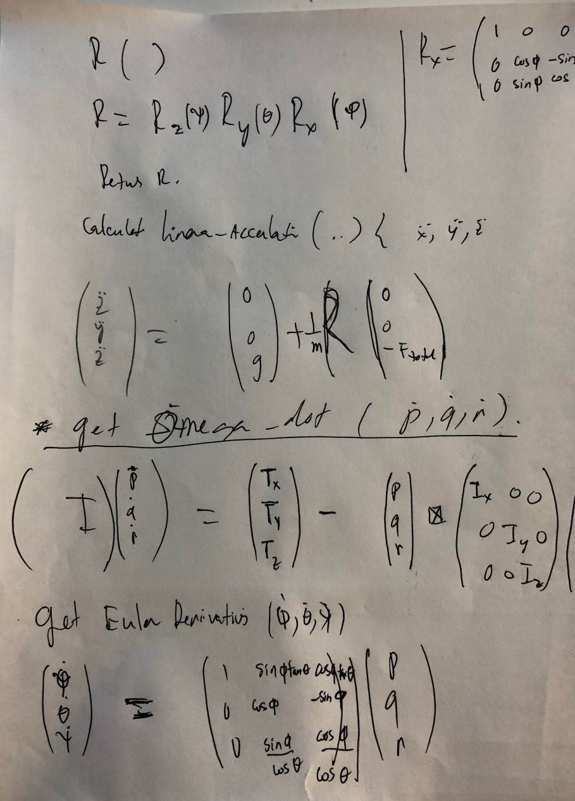
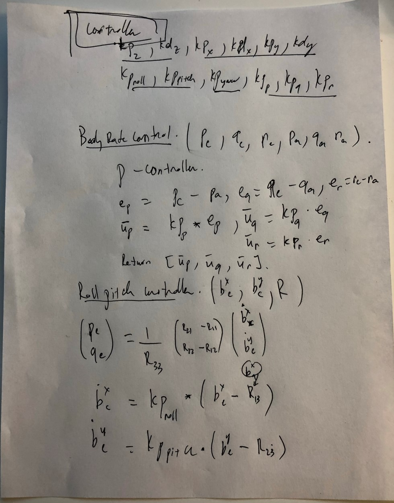
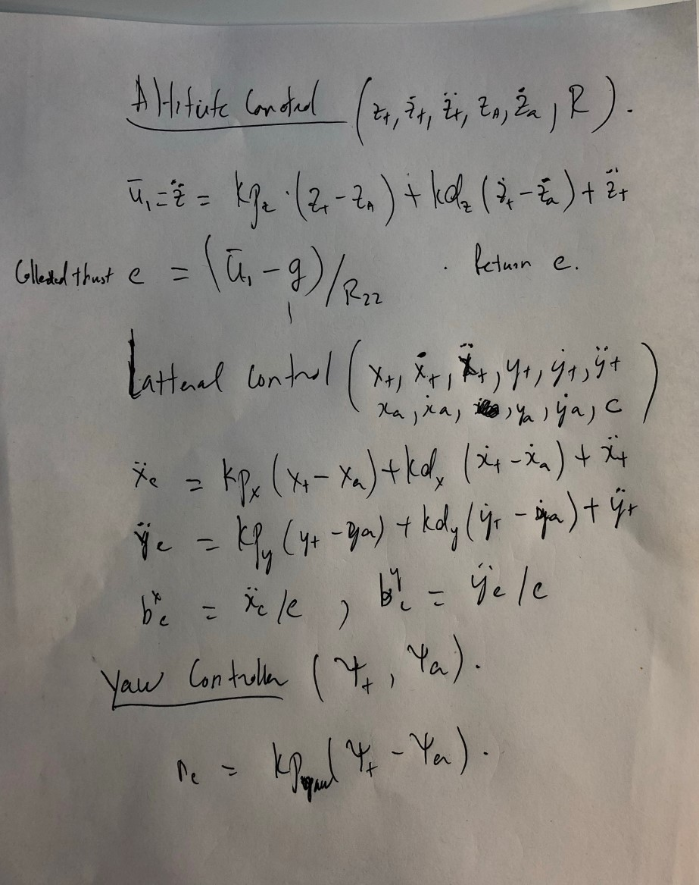

# 3D Drone Controls 

[video lectures ](https://www.youtube.com/playlist?list=PLNOpE0221wYIPqzDkwH61aslSyD8r7cRQ).

[Python code](https://github.com/tcdoan/self-driving-2/tree/master/3d_controllers). 

## Drone Controller Diagrams

